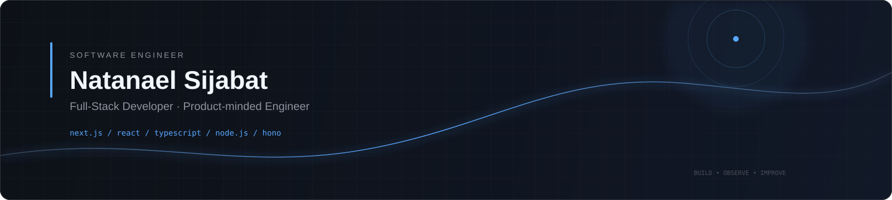
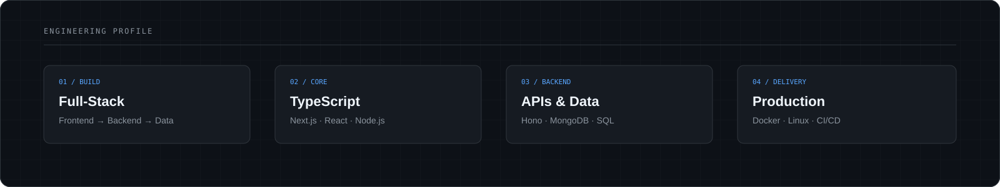
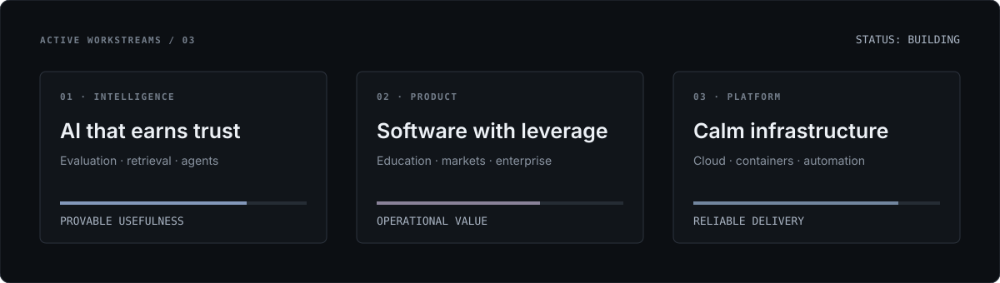
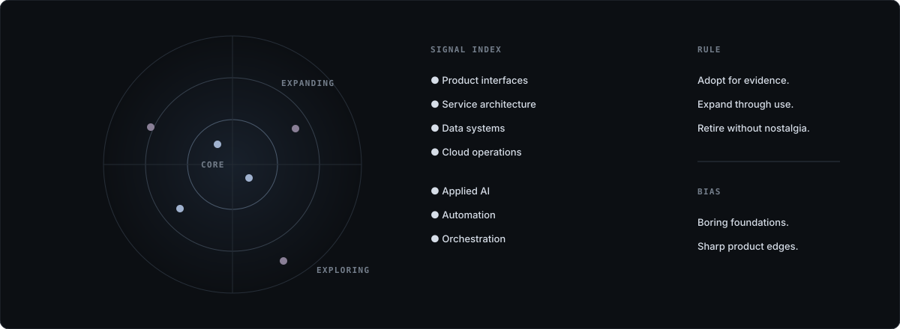
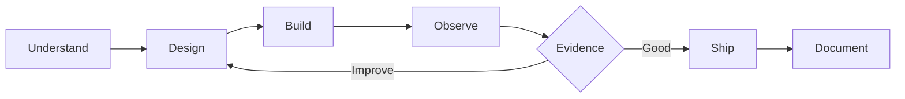
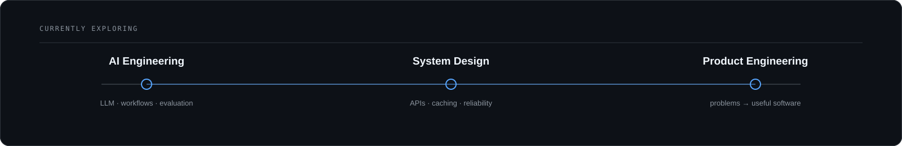
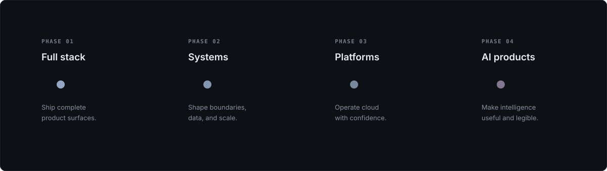
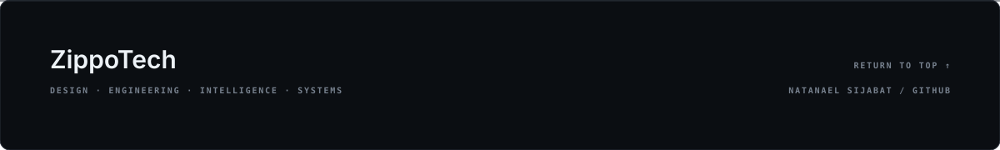

<!--
  ZIPPO/OS — GitHub profile interface for Natanael Sijabat
  Visuals are local, dependency-free SVGs designed for GitHub rendering.
-->

<div align="center">
  <a id="top"></a>
  
</div>

<p align="center">
  <a href="#identity">Identity</a>&nbsp;&nbsp;·&nbsp;&nbsp;
  <a href="#focus">Focus</a>&nbsp;&nbsp;·&nbsp;&nbsp;
  <a href="#projects">Projects</a>&nbsp;&nbsp;·&nbsp;&nbsp;
  <a href="#stack">Stack</a>&nbsp;&nbsp;·&nbsp;&nbsp;
  <a href="#principles">Principles</a>&nbsp;&nbsp;·&nbsp;&nbsp;
  <a href="#exploring">Exploring</a>&nbsp;&nbsp;·&nbsp;&nbsp;
  <a href="#contact">Contact</a>
</p>

<br />

<a id="identity"></a>

## `01 / IDENTITY`

> **Natanael Sijabat is a Full-Stack Developer focused on building reliable web applications, APIs, and product systems.**

Full-Stack Developer · Software Engineer · Product-minded Builder

I work across the stack — from frontend interfaces and backend APIs to databases, integrations, deployment, and production troubleshooting.

My strongest areas are **Next.js, React, TypeScript, Node.js/Hono, API development, and database-driven applications**.

<table>
  <tr>
    <td width="33%" valign="top">
      <sub>BUILD MODE</sub><br /><br />
      <strong>Full-Stack</strong><br />
      <sub>Frontend, backend, APIs, data, and deployment.</sub>
    </td>
    <td width="33%" valign="top">
      <sub>PRIMARY STACK</sub><br /><br />
      <strong>Next.js · TypeScript</strong><br />
      <sub>Modern web applications with strong boundaries.</sub>
    </td>
    <td width="34%" valign="top">
      <sub>ENGINEERING STYLE</sub><br /><br />
      <strong>Practical &amp; Product-minded</strong><br />
      <sub>Simple systems that solve real operational problems.</sub>
    </td>
  </tr>
</table>

<br />

<div align="center">
  
</div>

<br />

<a id="focus"></a>

## `02 / CURRENT FOCUS`

<div align="center">
  
</div>

<table>
  <tr>
    <td width="50%" valign="top">
      <strong>WEB &amp; PRODUCT</strong><br /><br />
      Building responsive and maintainable applications with Next.js, React, TypeScript, and modern frontend tooling.
    </td>
    <td width="50%" valign="top">
      <strong>BACKEND &amp; API</strong><br /><br />
      Designing REST APIs, business logic, integrations, authentication, validation, and service boundaries.
    </td>
  </tr>
  <tr>
    <td width="50%" valign="top">
      <strong>DATA &amp; PERFORMANCE</strong><br /><br />
      Working with MongoDB, MySQL, PostgreSQL, query optimization, caching, and reliable data flows.
    </td>
    <td width="50%" valign="top">
      <strong>DELIVERY &amp; INFRASTRUCTURE</strong><br /><br />
      Docker-based deployment, CI/CD, Linux environments, monitoring, debugging, and production operations.
    </td>
  </tr>
</table>

<br />

<a id="projects"></a>

## `03 / SELECTED PROJECTS`

<table>
  <tr>
    <td width="50%" valign="top">

### `COLLAB COOP`

**Cooperative &amp; marketplace platform**

A full-stack ecosystem for cooperative operations, payments, marketplace workflows, and member services.

**Focus**

- Full-stack application development
- REST API architecture
- MongoDB &amp; data modeling
- Payment integration
- Authentication &amp; authorization
- Docker-based deployment

</td>
    <td width="50%" valign="top">

### `COLAB RIDE`

**Ride &amp; courier experience**

A mobile-oriented ride workflow covering booking, quotation, driver matching, trip state, chat, history, and post-trip experience.

**Focus**

- React / Vite / Capacitor
- Hono backend
- Ride state management
- API integration
- UX state design
- Production-oriented debugging

</td>
  </tr>

  <tr>
    <td width="50%" valign="top">

### `HIMAPERSIS`

**Institutional web platform**

A modern web platform built around content, organization, and operational workflows.

**Focus**

- Next.js
- React
- TypeScript
- Hono
- Prisma
- MySQL
- Production deployment

<a href="https://himapersis.id">Visit project ↗</a>

</td>
    <td width="50%" valign="top">

### `ZIPPOTECH`

**Independent engineering lab**

A personal space for experiments, reusable software ideas, product concepts, and engineering exploration.

**Focus**

- Web applications
- AI-assisted workflows
- Developer tooling
- Product experiments
- Open-source exploration

</td>
  </tr>
</table>

<br />

<a id="stack"></a>

## `04 / ENGINEERING STACK`

### `CORE`

| Layer | Technologies |
|:--|:--|
| **Frontend** | Next.js · React · TypeScript · JavaScript |
| **Backend** | Node.js · Hono · Express · NestJS |
| **Database** | MongoDB · MySQL · PostgreSQL |
| **ORM / Data** | Prisma |
| **State & Data Fetching** | TanStack Query · Zustand · Redux |
| **Styling / UI** | Tailwind CSS · shadcn/ui |
| **Testing / API** | Postman · Browser DevTools |
| **Infrastructure** | Docker · Linux · CI/CD |
| **Version Control** | Git · GitHub |

### `WORKING WITH`

```text
Frontend
  Next.js · React · TypeScript · Vue · Nuxt

Backend
  Node.js · Hono · Express · NestJS · Laravel

Data
  MongoDB · MySQL · PostgreSQL

Platform
  Docker · Linux · CI/CD · VPS · Reverse Proxy

Engineering
  REST APIs · Authentication · Payments · Caching
  Performance Optimization · Debugging · System Design
```

<br />

<div align="center">
  
</div>

<br />

<a id="principles"></a>

## `05 / ENGINEERING PRINCIPLES`



<details>
  <summary><strong>How I approach engineering</strong></summary>
  <br />

  > **Understand before optimizing.**  
  > A fast solution to the wrong problem is still the wrong solution.

  > **Keep boundaries clear.**  
  > Business logic, infrastructure, and presentation should have understandable responsibilities.

  > **Prefer boring reliability.**  
  > Complexity should solve a problem, not create one.

  > **Observe production behavior.**  
  > Logs, metrics, errors, and user behavior are part of the engineering feedback loop.

  > **Ship incrementally.**  
  > Small, testable changes are easier to review, debug, and improve.

</details>

<br />

<a id="exploring"></a>

## `06 / CURRENTLY EXPLORING`

<div align="center">
  
</div>

<table>
  <tr>
    <td width="33%" valign="top">
      <sub>AI ENGINEERING</sub><br /><br />
      <strong>LLM applications</strong><br />
      <sub>AI-assisted workflows, structured outputs, evaluation, and useful product integration.</sub>
    </td>
    <td width="33%" valign="top">
      <sub>SYSTEM DESIGN</sub><br /><br />
      <strong>Scalable systems</strong><br />
      <sub>Architecture, distributed workflows, caching, queues, observability, and reliability.</sub>
    </td>
    <td width="34%" valign="top">
      <sub>PRODUCT ENGINEERING</sub><br /><br />
      <strong>Software with purpose</strong><br />
      <sub>Turning operational problems into simple and maintainable products.</sub>
    </td>
  </tr>
</table>

<br />

<a id="open-source"></a>

## `07 / OPEN SOURCE`

I prefer publishing software that is **focused, understandable, and reusable**.

Rather than optimizing for repository count, I focus on creating projects that demonstrate:

- Real engineering decisions
- Clear architecture
- Useful documentation
- Practical implementation
- Honest trade-offs

<p align="right">
  <a href="https://github.com/NatanaelSijabat?tab=repositories">
    Explore repositories →
  </a>
</p>

<br />

## `08 / TIMELINE`

<div align="center">
  
</div>

```text
       BUILD PRODUCTS
             │
             ▼
       DESIGN SYSTEMS
             │
             ▼
       OPERATE SOFTWARE
             │
             ▼
       IMPROVE THE PRODUCT
             │
             └───────────────► continuous engineering practice
```

<br />

<a id="contact"></a>

## `09 / SIGNAL`

<table>
  <tr>
    <td width="70%" valign="middle">
      <strong>Have a product, system, or engineering problem worth building?</strong><br />
      <sub>I'm interested in full-stack engineering, product development, backend systems, and practical AI integration.</sub>
    </td>
    <td width="30%" align="right" valign="middle">
      <a href="mailto:nael.working@gmail.com"><strong>Let's talk ↗</strong></a>
    </td>
  </tr>
</table>

<p align="center">
  <a href="https://github.com/NatanaelSijabat">GitHub</a>
  &nbsp;&nbsp;·&nbsp;&nbsp;
  <a href="https://www.linkedin.com/in/natanael-sijabat">LinkedIn</a>
  &nbsp;&nbsp;·&nbsp;&nbsp;
  <a href="mailto:nael.working@gmail.com">Email</a>
</p>

<br />

<div align="center">
  <a href="#top">
    
  </a>
</div>
