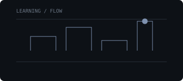
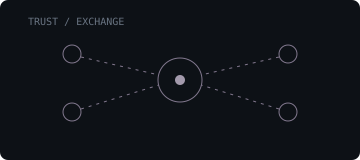
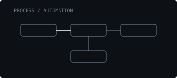
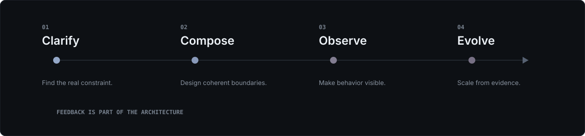
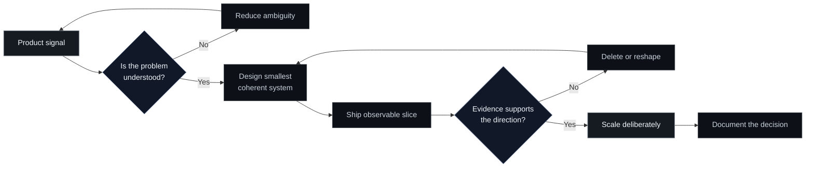
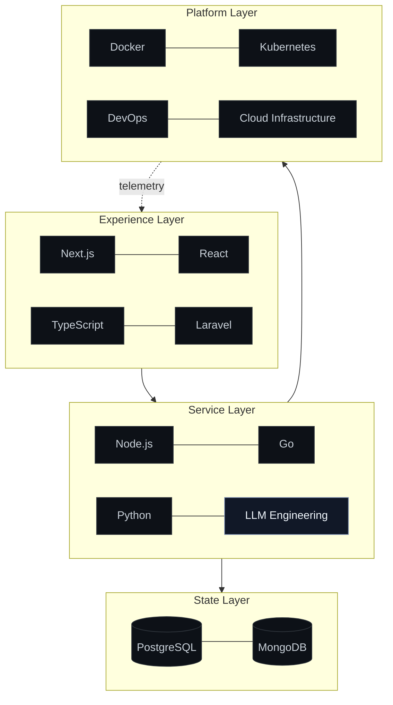

<!--
  ZIPPO/OS — GitHub profile interface for Natanael Sijabat
  All visuals are local, dependency-free SVGs designed for GitHub rendering.
-->

<div align="center">
  <a id="top"></a>
  
</div>

<p align="center">
  <a href="#identity">Identity</a>&nbsp;&nbsp;·&nbsp;&nbsp;
  <a href="#mission-control">Mission</a>&nbsp;&nbsp;·&nbsp;&nbsp;
  <a href="#product-ecosystem">Products</a>&nbsp;&nbsp;·&nbsp;&nbsp;
  <a href="#engineering-system">System</a>&nbsp;&nbsp;·&nbsp;&nbsp;
  <a href="#flight-plan">Roadmap</a>&nbsp;&nbsp;·&nbsp;&nbsp;
  <a href="#open-protocol">Open source</a>&nbsp;&nbsp;·&nbsp;&nbsp;
  <a href="#signal">Contact</a>
</p>

<br />

<a id="identity"></a>

## `01 / IDENTITY`

> **Natanael Sijabat operates at the intersection of systems, intelligence, and product.**  
> Senior Full Stack Engineer · AI Engineer · Cloud Engineer · Product Architect

<table>
  <tr>
    <td width="34%" valign="top">
      <sub>OPERATING LABEL</sub><br /><br />
      <strong>ZippoTech</strong><br />
      <sub>Software systems with product intent.</sub>
    </td>
    <td width="33%" valign="top">
      <sub>PRIMARY MODE</sub><br /><br />
      <strong>Builder / Architect</strong><br />
      <sub>From first principle to running system.</sub>
    </td>
    <td width="33%" valign="top">
      <sub>ACTIVE VECTOR</sub><br /><br />
      <strong>AI-native products</strong><br />
      <sub>Useful intelligence, reliable infrastructure.</sub>
    </td>
  </tr>
</table>

<br />

<div align="center">
  
</div>

<br />

<a id="mission-control"></a>

## `02 / MISSION CONTROL`

<div align="center">
  
</div>

<details>
  <summary><strong>Open the current build log</strong></summary>
  <br />

  | Channel | In motion | Desired outcome |
  |:--|:--|:--|
  | `INTELLIGENCE` | LLM workflows, prompt systems, retrieval, evaluation | AI features that earn trust through useful behavior |
  | `PRODUCT` | Education technology, marketplace platforms, enterprise software | Clear workflows with measurable operational value |
  | `PLATFORM` | Containers, orchestration, delivery pipelines, observability | Systems that remain understandable under pressure |
  | `AUTOMATION` | Repetitive process discovery and agent-assisted execution | Less manual coordination, more leverage |

</details>

<br />

<a id="product-ecosystem"></a>

## `03 / PRODUCT ECOSYSTEM`

<table>
  <tr>
    <td width="33%" valign="top">
      <br />
      <strong>Education Systems</strong><br />
      <sub>Learning operations, institutional workflows, and tools that help knowledge move.</sub>
    </td>
    <td width="33%" valign="top">
      <br />
      <strong>Marketplace Infrastructure</strong><br />
      <sub>Discovery, transactions, trust, and the operational machinery between them.</sub>
    </td>
    <td width="34%" valign="top">
      <br />
      <strong>Enterprise Automation</strong><br />
      <sub>Complex internal processes redesigned as calm, observable software.</sub>
    </td>
  </tr>
</table>

> [!NOTE]
> Product work is currently private. Public repositories appear when the underlying ideas are ready to be useful beyond their original context.

<br />

<a id="engineering-system"></a>

## `04 / ENGINEERING SYSTEM`

<div align="center">
  
</div>



<details>
  <summary><strong>Inspect the operating principles</strong></summary>
  <br />

  > **Clarity compounds.** Names, boundaries, and contracts are part of the product.  
  > **Simple is earned.** Remove accidental complexity without hiding essential complexity.  
  > **Observability is a feature.** A system should explain what it is doing.  
  > **Architecture follows pressure.** Scale decisions when evidence demands them.  
  > **Taste needs evidence.** Pair product intuition with user behavior and system signals.

</details>

<br />

### `TECHNOLOGY ARCHITECTURE`



<div align="center">
  <a href="./diagrams/product-system.mmd">source: product-system.mmd</a>
  &nbsp;·&nbsp;
  <a href="./diagrams/learning-graph.mmd">source: learning-graph.mmd</a>
</div>

<br />

### `TECH RADAR / DECISION CONTEXT, NOT A BADGE WALL`

<div align="center">
  
</div>

<table>
  <tr>
    <td width="25%"><sub>CORE / PRODUCT</sub><br /><strong>Next.js · React · TypeScript</strong></td>
    <td width="25%"><sub>CORE / SERVICES</sub><br /><strong>Laravel · Node.js · Python</strong></td>
    <td width="25%"><sub>CORE / DATA</sub><br /><strong>PostgreSQL · MongoDB</strong></td>
    <td width="25%"><sub>CORE / PLATFORM</sub><br /><strong>Docker · Cloud · DevOps</strong></td>
  </tr>
  <tr>
    <td><sub>EXPANDING</sub><br /><strong>Go</strong></td>
    <td><sub>EXPANDING</sub><br /><strong>Kubernetes</strong></td>
    <td><sub>EXPANDING</sub><br /><strong>LLM evaluation</strong></td>
    <td><sub>EXPLORING</sub><br /><strong>Agentic systems</strong></td>
  </tr>
</table>

<br />

<a id="flight-plan"></a>

## `05 / FLIGHT PLAN`

<div align="center">
  
</div>

<details>
  <summary><strong>View experiments and learning graph</strong></summary>
  <br />

  ```mermaid
  flowchart LR
      PE[Prompt Engineering] --> LE[LLM Engineering]
      LE --> EV[Evaluation Systems]
      EV --> AP[AI Product Design]
      SD[System Design] --> DI[Distributed Infrastructure]
      DI --> OP[Operational Intelligence]
      AU[Automation] --> WF[Durable Workflows]
      WF --> AP
      OP --> AP
  ```

  **Current experiments**

  - Evaluation-first LLM features where quality is measured before scale.
  - Human-in-the-loop automation for consequential enterprise workflows.
  - Product architectures that can move from modular monolith to distributed services without ceremony.
  - AI interfaces that reveal confidence, provenance, and operational state.

</details>

<br />

<a id="open-protocol"></a>

## `06 / OPEN PROTOCOL`

> Open source is not a publishing quota. It is a commitment to leave behind **reusable decisions**: focused tools, legible examples, honest trade-offs, and documentation that respects the next engineer’s time.

<table>
  <tr>
    <td width="33%" valign="top">
      <sub>RELEASE FILTER 01</sub><br /><br />
      <strong>Is it independently useful?</strong><br />
      <sub>Extract capability, not company-specific residue.</sub>
    </td>
    <td width="33%" valign="top">
      <sub>RELEASE FILTER 02</sub><br /><br />
      <strong>Can it be understood?</strong><br />
      <sub>Examples and boundaries before promotion.</sub>
    </td>
    <td width="34%" valign="top">
      <sub>RELEASE FILTER 03</sub><br /><br />
      <strong>Can it be maintained?</strong><br />
      <sub>A smaller dependable surface beats a broad abandoned one.</sub>
    </td>
  </tr>
</table>

### `REPOSITORY SHOWCASE / PUBLIC WINDOW`

| State | Repository signal | What belongs here |
|:--:|:--|:--|
| `◌` | **Extracting** | Internal patterns being reduced to reusable primitives |
| `◐` | **Hardening** | Documentation, examples, interfaces, and failure modes |
| `●` | **Publishing** | Focused releases with a clear reason to exist |

<p align="right"><a href="https://github.com/NatanaelSijabat?tab=repositories">Open repository index →</a></p>

<br />

## `07 / TIMELINE`

<div align="center">
  
</div>

```
  BUILD THE SURFACE       DESIGN THE SYSTEM       OPERATE THE PLATFORM      TEACH THE PRODUCT
          │                       │                        │                       │
          └──── interfaces ───────┴──── services ─────────┴──── intelligence ─────┘

                   one continuous practice: turning ambiguity into software
```

<br />

<a id="signal"></a>

## `08 / SIGNAL`

<table>
  <tr>
    <td width="70%" valign="middle">
      <strong>Build something that should exist.</strong><br />
      <sub>For product architecture, AI systems, cloud platforms, or thoughtful engineering collaboration.</sub>
    </td>
    <td width="30%" align="right" valign="middle">
      <a href="mailto:nael.working@gmail.com"><strong>Start a conversation ↗</strong></a>
    </td>
  </tr>
</table>

<p align="center">
  <a href="https://github.com/NatanaelSijabat">GitHub</a>&nbsp;&nbsp;·&nbsp;&nbsp;
  <a href="https://www.linkedin.com/in/natanael-sijabat">LinkedIn</a>&nbsp;&nbsp;·&nbsp;&nbsp;
  <a href="mailto:nael.working@gmail.com">Email</a>
</p>

<br />

<div align="center">
  <a href="#top"></a>
</div>